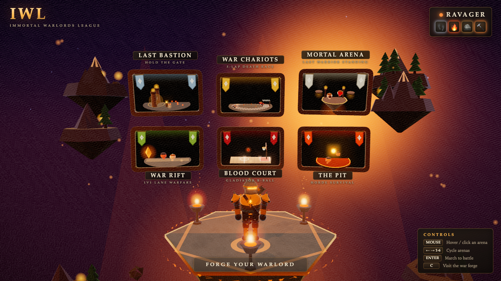
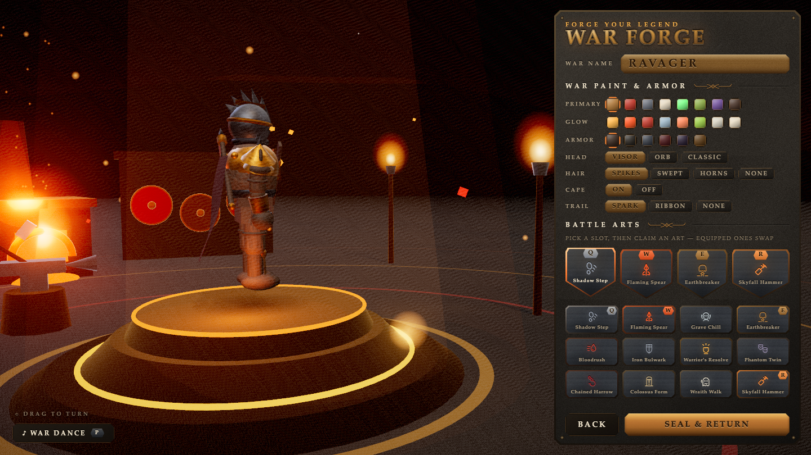
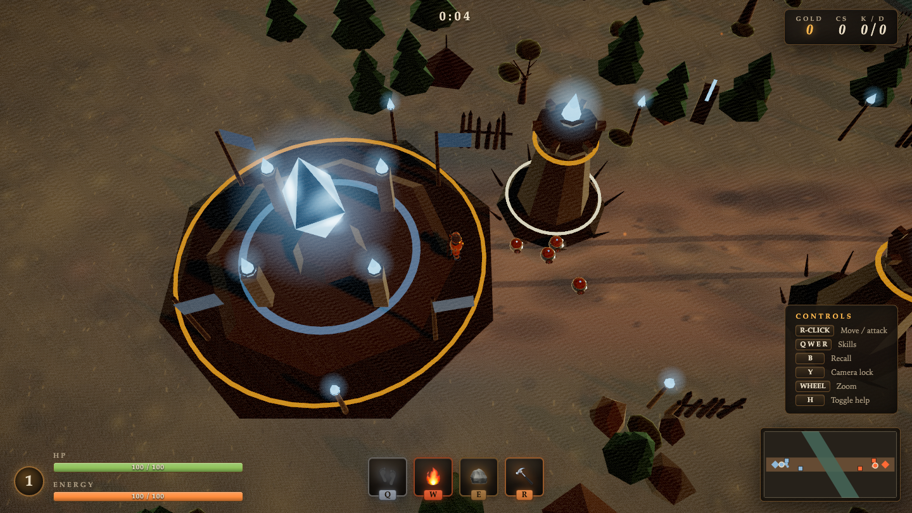
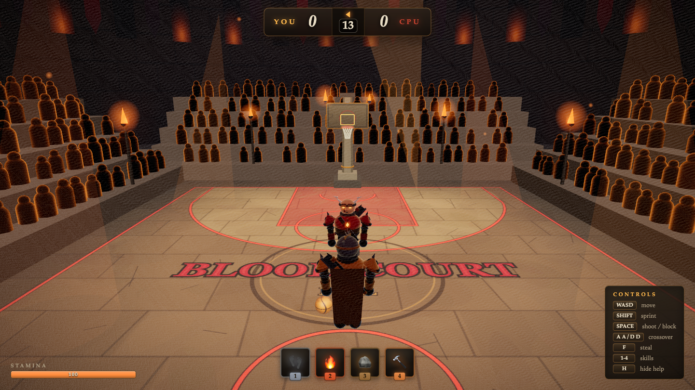
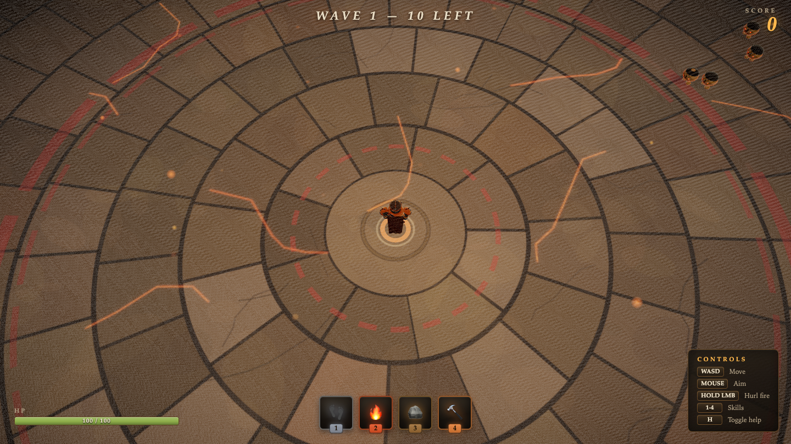
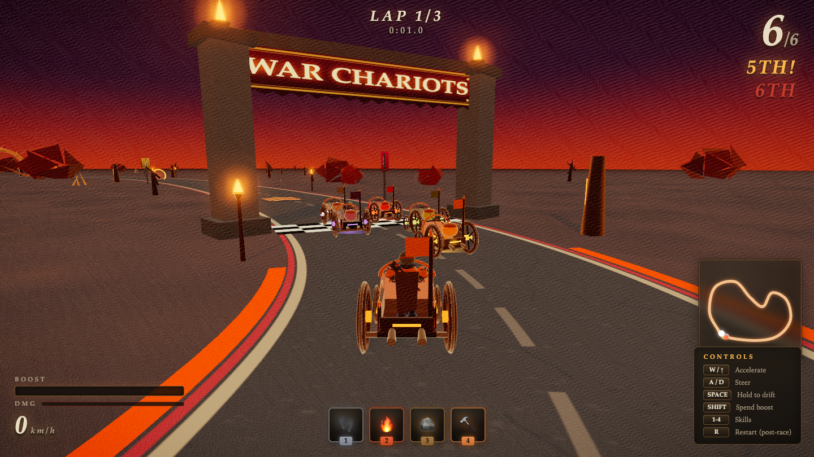
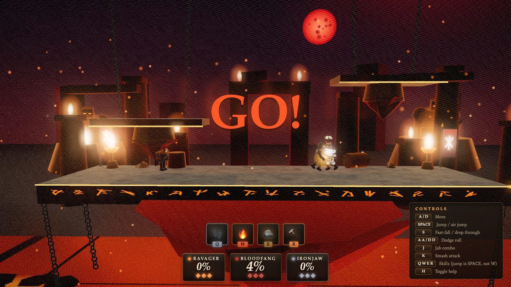
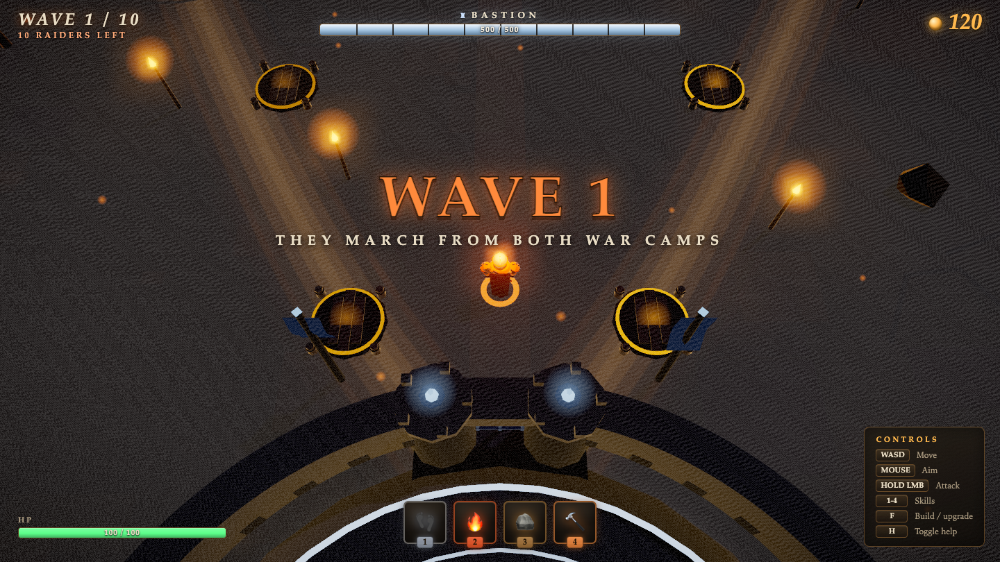

# Warrior League — Immortal Warlords League

A browser meta-game with a dark-fantasy warrior soul: forge **one warlord** — war paint, armor, and four battle arts — then march them into full game clones through a torchlit arena hub. Your warrior, your arts, every battleground.

A themed fork of [arcade_games](https://github.com/viyercal/arcade_games): same engine and mechanics, completely re-imagined art direction — torchlight, stone, bronze, iron, embers, and war banners in place of neon. Built with Three.js; **every asset is procedural** — no models, textures, fonts, or audio files. Toon + rim-light shaders, HDR bloom that reads as firelight, dynamic shadows, procedural VFX, and a war-drum synth soundtrack, all generated at runtime.

## The battlegrounds

| Arena | Clone of | What your battle arts become |
|---|---|---|
| **War Rift** | League of Legends | Shadow Steps, Flaming Spears, Skyfall Hammers — lane warfare vs an AI champion with raiders, watchtowers, gold & levels |
| **Blood Court** | NBA 2K / NBA Jam | Gladiator ball in a torchlit colosseum — colossus dunks and comet alley-oops, first to 11 |
| **The Pit** | Horde brawler | Full power fantasy vs 8 waves and the Pit Warden in a volcanic fighting pit |
| **War Chariots** | Mario Kart | Flaming ballista bolts, ice slicks, colossus mode — a 3-lap death race through scorched badlands |
| **Mortal Arena** | Super Smash Bros | Damage-% knockback over a lava chasm, 3 stocks, blood-red moon — last warrior standing |
| **Last Bastion** | Tower defense | Build ballista towers and hold the gate through 10 waves and the Siege Colossus |

The same 12 battle arts (Shadow Step, Flaming Spear, Grave Chill, Earthbreaker, Bloodrush, Iron Bulwark, Warrior's Resolve, Phantom Twin, Chained Harrow, Colossus Form, Wraith Walk, Skyfall Hammer) are reinterpreted per battleground — the War Forge tooltips tell you what each art does in each world before you enter.

## Screenshots

| | |
|---|---|
|  |  |
|  |  |
|  |  |
|  |  |

## Run it

```bash
npm install
npm run dev        # → http://localhost:5173
```

Jump straight into a scene: `http://localhost:5173/?scene=moba|hoops|arena|kart|brawl|siege|hub|loadout` (`&mute=1` for silence).

## Controls

- **Hub** — hover/click an arena, ←/→ + Enter, C for the War Forge
- **War Rift** — right-click move/attack, QWER arts, B recall, Y camera lock, wheel zoom
- **Blood Court** — WASD move, Shift sprint, hold/release Space to shoot (time the meter!), F steal, double-tap A/D crossover, 1-4 arts
- **The Pit** — WASD move, aim with mouse, hold LMB blaster, 1-4 arts
- **War Chariots** — W accelerate, A/D steer, hold Space to drift (release for mini-turbo), Shift spend boost, 1-4 arts
- **Mortal Arena** — A/D move, Space jump/air-jump, S fast-fall, J jab, K smash, double-tap A/D dodge, QWER arts
- **Last Bastion** — WASD move, hold LMB blaster, F build/upgrade ballistae, 1-4 arts
- **Esc** returns to the hub from anywhere; H toggles help in games

## Architecture

- `src/core/` — engine (renderer, post chain, loop), input hub, scene router, procedural audio
- `src/art/` — toon/rim/plasma materials, environment kit, warrior character factory, VFX pool
- `src/meta/` — hub, War Forge, the universal 12-art catalog
- `src/games/` — one folder per battleground, each a self-contained scene module
- `qa/` — Playwright screenshot + real-input probes used to verify every flow

`CONTRACTS.md` documents the scene-module contract, shared API, and the warrior art direction.
